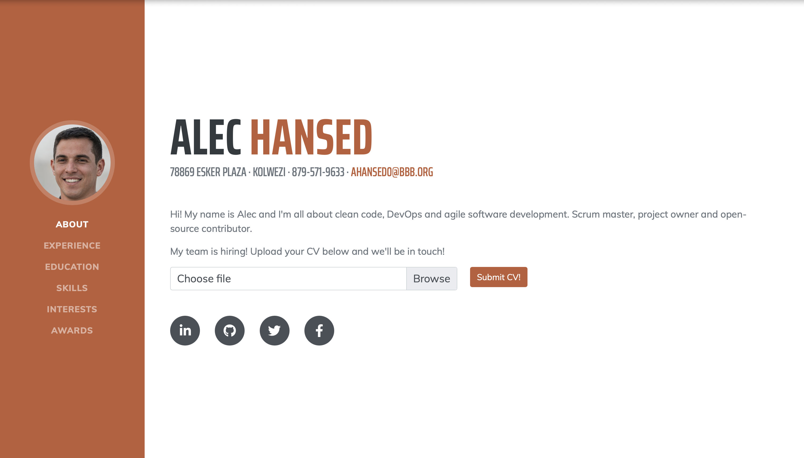

# Unrestricted File Upload Exercise

This repository contains a deliberately vulnerable web application exhibiting an unrestricted file upload vulnerability.

> [!WARNING]
> Use these materials sensibly and legally please. Using any of the techniques discussed here against any website when you have not been granted explicit permission (in writing!) to do so is a serious criminal offence that will get you in trouble very quickly.

## Purpose



I use this as part of a practical activity in my seminars on cybersecurity for business students. It allows students to get hands-on in conducting a cyberattack aimed at defacing a website/exfiltrating data from it without leaving the browser.

## Setup

**Do not deploy this intentionally vulnerable web application on any webserver unless you don't mind destroying it.**

This project is designed to run on a LAMP stack. 

First, you'll need to install PHP dependencies for the victim service, which are managed by Composer. Do so like this:

```bash
cd victim-service
wget https://getcomposer.org/composer.phar
php composer.phar install
```

Or, if you already have Composer installed:

```bash
composer install
```

Now, configure Apache to separately serve (under different subdomains, for example) the two folders under the root of this project (`/attacker-service` and `/victim-service`). Alternatively, to run the project locally, ensure that PHP 7.0+ is installed and run the following from either of the aforementioned folders:

```bash
php -S localhost:8080
```

You'll then be able to access the relevant web application at:

```
http://localhost:8080
```

### Deployment

If you want to add this application to your vhosts, config files are included in the `/vhosts` folder to get you started. 

Rename these, update them with your server names/document roots and copy them to `/etc/apache2/sites-available`. Activate them with `a2ensite` and run `letsencrypt` or similar to configure HTTPS automatically.

## Usage

Follow this workflow to conduct the cyberattack on the web application:

1. First, visit the attacker service. 
2. You should see 3 files here. Download the file `test.jpeg` to your computer in your downloads folder.
3. Now, upload this file to the web application via the file upload box and click "Submit CV!"
4. Browse to `/uploads/test.jpeg` and you should see your file. Now you know where files are stored once they are uploaded.
5. Next, go back to the attacker service and download `testvuln.php.txt` to your computer.
6. Rename this file by removing the `.txt` extension, leaving just `testvuln.php`.
7. Now, upload this to the site as you did with the image in step 3.
8. Now browse to `/uploads/testvuln.php` You'll see the web server spitting out a bunch of information about itself. This means that you are able to upload and execute PHP code on the web server.
9. Now, repeat steps 5-7 with `shell.php.txt`, available from the attacker service.
10. Now, carefully enter the following in your browser address bar after the domain: `/uploads/shell.php?cmd=cat /etc/passwd`
11. You should see that you've executed a command to steal information about users on the server.
12. Finally, carefully enter the following in your browser address bar after the domain: `/uploads/shell.php?cmd=echo Hacked! > ../index.php`
13. You should now see that the vulnerable web application shows the message `Hacked!`, and the web application is no longer available.

### Patching the Application

In case the audience is more technical, you may want to show how to patch the vulnerabilities in the application.

To do so, perform a project-wide search for `TODO` to find each code change that needs to be made. Patched code is included as comments.

Apache will need to be reconfigured to disallow the download of files in `/uploads`. Do this my renaming `.htaccess.patch` (under `/victim-service/uploads`) to `.htaccess`. Ensure that your Apache installation [allows .htaccess overrides](https://httpd.apache.org/docs/2.4/howto/htaccess.html) in the web root directory.

## Acknowledgements

The following libraries are used by the project frontend, but are included from CDNs (i.e. not dependency-managed) for ease of deploying the project and resetting it for the next group of students. This means you'll need internet connectivity to run the project properly (even on local):

* [jQuery v3.5.1](https://jquery.com)
* [jQuery UI Easing v1.4.1](https://jqueryui.com/easing/)
* [Bootstrap v4.5.0](https://getbootstrap.com/docs/4.0/getting-started/introduction/)
* [FontAwesome v5.13.0](https://fontawesome.com/v5/search)

Fonts used include: 

* [Saira Extra Condensed](https://fonts.google.com/specimen/Saira+Extra+Condensed)
* [Mulish](https://fonts.google.com/specimen/Mulish)

The frontend for this project is based on the [StartBootstrap Resume Template](https://startbootstrap.com/theme/resume).

## Copyright and License

Copyright 2023 Saul Johnson. Code released under the [MIT](https://github.com/StartBootstrap/startbootstrap-blog-post/blob/gh-pages/LICENSE) license.
